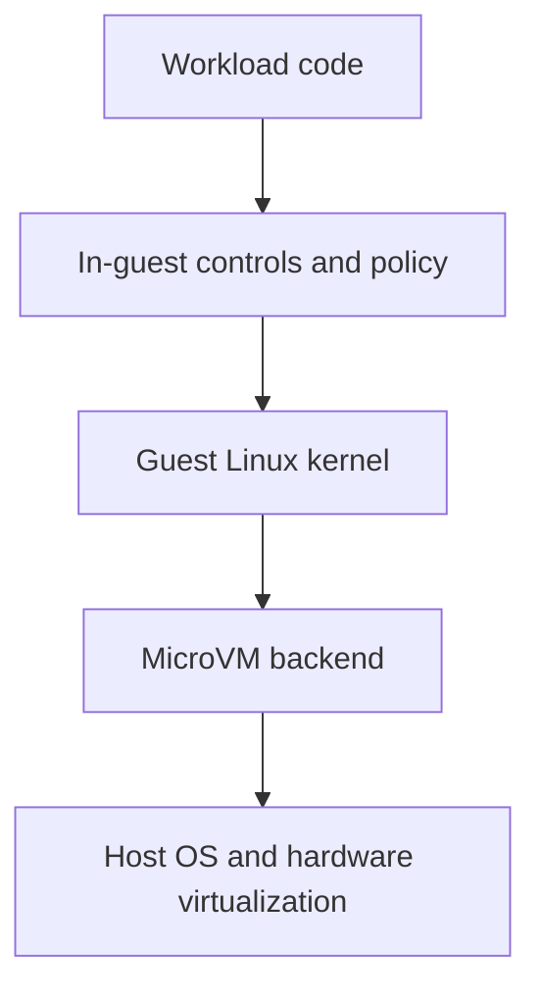
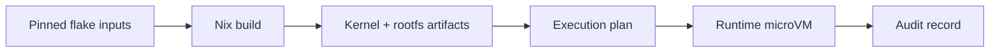
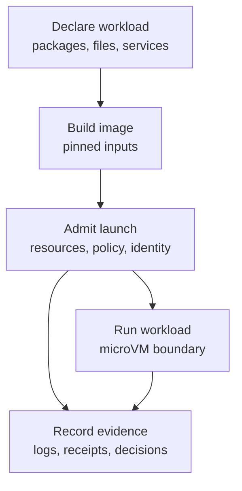

Infrastructure teams increasingly need to run code they did not write.

That code may be a user-submitted script, an AI-generated tool call, a dependency install hook, a CI job, a data-processing task, or a small service that needs to run near sensitive files and credentials. The old answer was often "put it in a container." Containers are useful, fast, and familiar, but they were not designed to be the final security boundary for hostile workloads.

That does not mean containers are bad. It means we should be clear about what problem they solve. Containers are excellent packaging and process-isolation tools. When the workload is untrusted, generated, or simply surprising, infrastructure needs more than packaging. It needs a security boundary that is explicit, narrow, and easy to reason about.

Two technologies are especially useful for that:

- **microVMs**, which give each workload its own small virtual machine boundary.
- **Nix**, which makes the software inside that boundary reproducible, pinned, and auditable.

This post is a high-level tour of why those pieces matter and how they fit into a practical security model. It avoids deep implementation detail on purpose. The goal is to explain the shape of the system before diving into kernel command lines, seccomp profiles, vsock protocols, or Nix derivations.

## Start with the problem

The hard part is not launching code. The hard part is launching code while preserving control.

Modern infrastructure runs a lot of code that sits somewhere between "trusted application" and "obviously hostile malware." Examples include:

- a CI job from a pull request;
- a plugin installed during a build;
- a script generated by an AI agent;
- a package post-install hook;
- a one-off data migration;
- a customer-supplied function;
- a development environment with access to source code and credentials.

The security question is simple: if that code misbehaves, what can it reach?

A useful system should make the answer boring. The workload should not automatically inherit host filesystem access, ambient credentials, broad network access, or control over neighboring workloads. It should get what it needs, through a policy that can be inspected and changed.

That leads to a few design goals:

- **Strong isolation**: a workload should not be able to freely access the host or other workloads.
- **Small attack surface**: the boundary should expose as little as practical.
- **Reproducible inputs**: the thing being run should come from pinned, inspectable inputs.
- **Explicit policy**: filesystem, network, secrets, and resources should be declared rather than implied.
- **Auditability**: important runtime decisions should leave evidence.
- **Honest limits**: weaker backends and unsupported claims should be named clearly.

MicroVMs and Nix address different parts of this model.

## MicroVMs reduce runtime blast radius

A microVM is a small virtual machine designed for fast startup and low overhead. It is still a VM: it has a guest kernel, a guest filesystem, virtual devices, and a hypervisor boundary beneath it. The "micro" part means the device model and runtime surface are intentionally smaller than a general-purpose virtual machine.

That distinction matters for security.

Containers share the host kernel. A container can be locked down with namespaces, cgroups, seccomp, capabilities, and filesystem policy, and those controls are valuable. But if the workload finds a path through the host kernel or container runtime, the boundary can collapse.

A microVM puts a guest kernel between the workload and the host. The workload can still attack its own guest environment, but reaching the host requires crossing the virtualization boundary too.

At a high level, the runtime stack looks like this:

Each layer narrows the blast radius of a mistake in the layer above it. A bug in application code should not imply host file access. A compromised process inside the guest should not imply control of the host. A broad tool call should still pass through policy and audit surfaces.

The most important benefits are:

- **Kernel separation**: the workload runs on a guest Linux kernel rather than directly on the host kernel.
- **Smaller device surface**: microVM backends expose a smaller set of virtual devices than a traditional full VM.
- **One workload per boundary**: the VM can be treated as the sandbox, not as a shared server for mutually distrusting tenants.
- **Clearer failure domains**: when something goes wrong inside the guest, the host is still outside the normal execution environment.

This is not a claim that microVMs make untrusted code harmless. They reduce the blast radius. You still need policy, resource limits, careful device exposure, controlled communication, and a realistic threat model.

## Nix reduces build-time ambiguity

Isolation answers "where does this code run?" Nix helps answer "what exactly is running?"

That second question is just as important. A sandboxed workload is harder to reason about if its image was assembled from mutable package repositories, unpinned install scripts, or manual shell history. Security is not only about the runtime boundary. It is also about the supply chain that produced the thing crossing that boundary.

Nix gives infrastructure teams three high-level advantages:

- **Pinned inputs**: a `flake.lock` records exact dependency revisions, so rebuilds do not silently drift because an upstream package changed.
- **Repeatable image construction**: the guest image is built from a declarative definition rather than a hand-mutated machine.
- **Auditable closures**: the files and packages that enter the VM image are explicit build outputs, which makes provenance and review more practical.

For developers, this means the workload definition can stay close to the code. A flake can say which packages, services, health checks, and files the guest needs. A build system can then produce a Linux image from that definition and boot it in a microVM.

The result is a cleaner chain:

The important part is not that every user becomes a Nix expert. The important part is that the runtime can treat the workload image as a known artifact, not an informal pile of setup steps.

Nix does not eliminate supply-chain risk. A pinned malicious dependency is still malicious. What Nix improves is visibility and repeatability. You can review what changed, rebuild the same artifact, and connect a runtime event back to a specific set of inputs.

## Build-time security and runtime security are different

It is tempting to think of "sandboxing" as only a runtime feature. In practice, there are at least two separate questions:

- **Build-time**: how was the image produced, and from which inputs?
- **Runtime**: what can the workload access once it starts?

A strong design handles both. If build-time inputs are mutable, the runtime may faithfully isolate an artifact nobody can explain. If runtime policy is weak, a beautifully reproducible image may still have too much access.

A practical flow separates the stages:

Each step should have a narrow job:

- The **definition** describes intent.
- The **build** produces an artifact from pinned inputs.
- The **admission step** decides whether that artifact may run with requested resources and policies.
- The **runtime** creates the isolation boundary.
- The **audit path** records the decisions that matter later.

This separation is useful operationally, but it is also useful for security. If something goes wrong, you can ask which boundary was involved: build, admission, backend launch, guest control, network policy, secret release, or audit.

## Policy should be explicit

Isolation creates the boundary. Policy decides what crosses it.

The common failure mode is ambient access: the workload gets the current directory, the developer's environment variables, the host network, the default credentials, and whatever else happened to be available. That is convenient, but it makes the security story hard to explain.

For untrusted or semi-trusted workloads, policy should be declared:

- Which host paths are mounted, if any?
- Are mounts read-only or writable?
- Which network destinations are allowed?
- Which secrets can be released?
- How much CPU, memory, and disk can be consumed?
- Which host actions are available through the control protocol?

This is where microVMs and Nix complement each other. Nix makes the guest image more predictable. The microVM makes the runtime boundary stronger. Policy controls the intentional openings in that boundary.

## Auditability turns claims into evidence

Security claims are easier to trust when the system records the decisions behind them.

For infrastructure teams, useful evidence includes:

- the image or artifact identity;
- the policy admitted for the run;
- the backend used to launch it;
- the resources requested and granted;
- the secrets or mounts exposed;
- the network policy applied;
- the result of the workload.

This does not need to be complicated to be valuable. Even local audit records help answer basic questions after the fact: what ran, from what inputs, with which privileges, and under which boundary?

Without that evidence, "secure by default" becomes a slogan. With it, teams can inspect the actual behavior of the system.

## Backend differences should be visible

Not every runtime backend has the same properties.

Firecracker on Linux with KVM, Apple Virtualization.framework on macOS, libkrun, Docker, and process-level fallbacks all sit at different points on the isolation spectrum. They may be useful for different reasons, but they should not all inherit the same security claims.

A mature system should make backend differences visible:

- Is this a hardware-virtualized boundary?
- Does the workload get a guest kernel?
- Is this a compatibility fallback?
- Which claims apply to this backend?
- Which claims do not apply?

This matters because infrastructure users should not need to reverse-engineer the security posture from implementation details. The runtime should say what it is doing.

## What this does not solve

A high-level security post should also be clear about limits.

A microVM sandbox does not defend against a malicious host. The host owns the hypervisor, local keys, storage, and control plane. If the host is compromised, the sandbox cannot protect itself from that host.

MicroVMs also do not remove the need for guest hardening. The guest still has packages, services, users, files, and kernel configuration. A smaller boundary helps, but it does not absolve the system from maintaining the guest.

Nix does not turn dependency selection into a solved problem. Pinned inputs make builds more reproducible and reviewable, but users still need to choose trustworthy dependencies and update them intentionally.

And no local sandbox should be treated as a substitute for organizational controls such as code review, secrets management, patching, logging, and incident response.

## How mvm applies this

`mvm` is built around this model.

It uses microVMs because untrusted code deserves a real isolation boundary. It uses Nix because secure execution starts before boot, with knowing what is in the image. Around those pieces, `mvm` adds builder isolation, launch admission, explicit policy, backend tiering, guest RPC, and audit records.

The goal is not to make every developer a virtualization or Nix expert. The goal is to make the safer path the normal path: pinned inputs, named policies, clear backend claims, and a microVM boundary for workloads that should not be trusted with the host.

That is the foundation. Deeper posts can go layer by layer: verified boot, vsock framing, guest-agent hardening, egress policy, secret release, and how the Nix image pipeline turns a workload definition into a bootable microVM.
