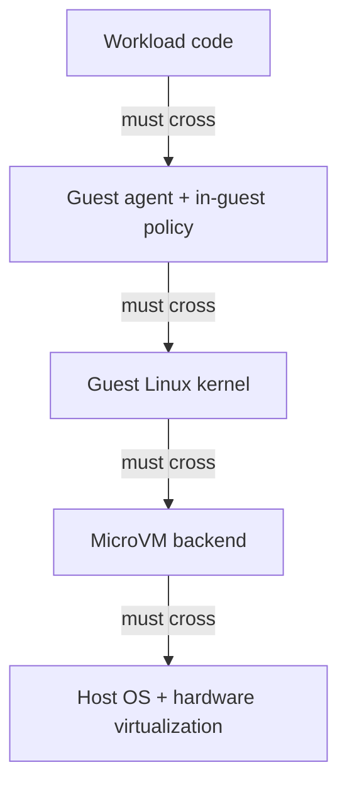
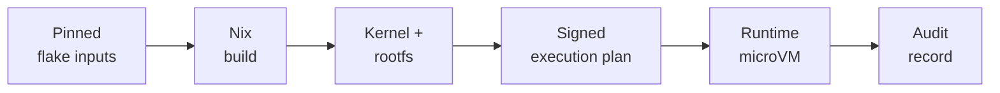
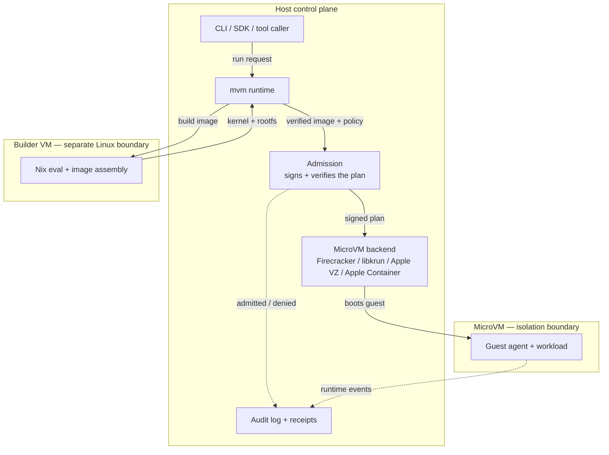

Sooner or later, every infrastructure team ends up running code it didn't write.

Maybe it's a script a user pasted in. Maybe it's a tool call an AI agent decided to make, or a dependency's install hook, or a CI job, or some data-processing task that happens to live next to your credentials. For a long time the reflex answer was "just put it in a container." And containers are great. They're everywhere, and most people already know how to use them. They were just never designed to be the thing standing between hostile code and your host.

So we started from a different assumption. If a piece of code might be untrusted, or generated, or simply weird in ways you didn't anticipate, then the wall around it should be strong by default, not strong only when you remember to make it strong. Two tools fit that assumption well:

- **microVMs** give each workload its own small virtual machine.
- **Nix** makes the software inside that machine reproducible, pinned, and easy to audit.

The rest of this post is how they fit together. It stays at the architecture level on purpose; we're after the shape of the system, not the kernel command lines, the seccomp profiles, or the Nix derivations. Those are their own posts.

## What we actually need

A runtime like this has to cover a lot of ground: dev environments, agent sandboxes, code interpreters, CI-style jobs, the occasional service experiment. The tension is always the same. Make it strong enough that "run this code" doesn't quietly turn into "trust this code with the whole machine," but keep it light enough that people don't route around it.

That shakes out into a few properties:

- **Real isolation.** Workload code can't wander into the host filesystem, the host's credentials, or a neighbor's data.
- **Legible boundaries.** Build, launch, guest control, network, secrets, and audit each have an obvious home in the architecture instead of being smeared across everything.
- **Reproducible inputs.** The image that boots comes from something pinned and inspectable, not a pile of setup steps somebody ran once.
- **Fast iteration.** A boundary nobody uses protects nothing.

That last point is worth sitting with. Security work fails far more often from being ignored than from being wrong.

## microVMs: a real boundary at runtime

A microVM is a small virtual machine built for fast startup and low overhead. It's still a full VM underneath, with its own guest kernel, its own filesystem, virtual devices, and a hypervisor below all of it. The "micro" just means the device model is kept deliberately small.

That separate kernel is the whole reason we reach for it. A container shares the host kernel. You can lock one down hard with namespaces, cgroups, seccomp, and capabilities, and you absolutely should, but the moment a workload finds a way through the host kernel or the container runtime, the wall is gone. A microVM puts a *separate* guest kernel in between. Breaking out of your own little Linux environment isn't enough anymore; you'd also have to break the virtualization boundary, which is a much taller order.

The useful way to picture it is as a stack where each layer absorbs a mistake in the one above:

A bug in application code shouldn't get you host files. A compromised process inside the guest shouldn't get you the host. A sweeping tool call should still pass through policy and audit on its way out.

Treating the VM as the sandbox gives us a few rules:

- **One workload per boundary.** This is a sandbox, not a shared server for tenants who distrust each other.
- **No host access by default.** The guest gets its own process tree, its own network, and a filesystem that stops at the share you declared.
- **Guest RPC, not a shell.** Anything host-facing goes through a controlled protocol, never a raw shell.
- **Honest backend tiers.** When a backend genuinely can't offer the same isolation, we say so. Firecracker on Linux KVM and a Docker fallback are not the same wall, and labeling them as if they were would be dishonest.

None of this means the microVM "solves" security. It gives you a hardware-backed boundary worth building the rest of the system around.

## Nix: knowing what's actually inside

Isolation tells you *where* the code runs. It says nothing about *what's in there*, and that second question matters just as much. An image stitched together from mutable package repos, unpinned install scripts, and somebody's shell history is exactly the kind of thing you can't reason about. The boundary at runtime is half the story; the supply chain that produced the thing crossing it is the other half.

This is the part Nix is good at:

- **Pinned inputs.** A `flake.lock` records exact dependency revisions, so a rebuild doesn't silently change because some upstream package moved.
- **Repeatable images.** The image is built from a declarative definition, not a machine somebody poked at by hand.
- **Auditable closures.** The packages and files that end up inside are explicit build outputs, which is what makes provenance and review doable instead of aspirational.

Day to day, the workload definition lives right next to the code. A flake spells out the packages, services, health checks, and files the guest needs, and the runtime turns that into a Linux image and boots it in a microVM. Nobody has to become a Nix wizard for this to pay off. The win is simply that the image is a known artifact you can cache, identify, sign into a launch plan, and trace back later when something looks off, instead of an informal pile of "I think I installed that at some point."

Put end to end, the path from source to running VM becomes a chain you can actually follow:

One wrinkle worth calling out, especially on macOS: the thing you're building is a *Linux* guest image, and a Mac can't natively assemble a Linux filesystem. So mvm runs the actual Nix evaluation and image assembly inside a small Linux builder VM rather than on the host. Your machine just orchestrates — invoking the build, moving artifacts around — while the Linux-specific work happens in a Linux environment. As a bonus, that keeps the build reproducible across host operating systems: the same flake produces the same image whether you started from macOS or Linux.

## How the pieces fit

The thing we were careful about is that none of this collapses into one big privileged operation. Build, admission, backend launch, and guest control each sit behind their own boundary.

Each box has one job:

- **Builder VM** — Linux Nix evaluation, builds, and image assembly.
- **mvm runtime** — the host process you invoked (CLI or SDK). It drives the builder VM, runs admission inline, picks the backend, and writes down what happened. It isn't a long-lived supervisor daemon sitting above the stack — it's the command you ran.
- **Admission** — binds artifact identity, resources, policy, a validity window, and replay handling into a signed execution plan before anything boots.
- **MicroVM backend** — stands up the isolated boundary. Each VM gets its own supervisor process (for example `mvm-libkrun-supervisor`) that re-verifies the signed plan at boot and bridges the guest's audit events back to the host log.
- **Guest agent** — the controlled in-guest work: running a process, touching the filesystem, reporting readiness, telemetry.
- **Audit** — quietly records the decisions that mattered.

The reason to split it up this way is partly security and partly just operations. When something breaks at 2am, "which boundary was involved?" has a real answer: build, admission, backend launch, guest control, network policy, secret release, or audit. That beats staring at one giant privileged blob.

## What this design doesn't claim

We try to be honest about the edges, too:

- **It doesn't protect you from a malicious host.** The host holds the hypervisor, the local keys, and the control plane. If the host itself is compromised, the sandbox can't save you from it. That's the trust boundary, and pretending otherwise would be marketing.
- **It doesn't treat every backend as interchangeable.** Firecracker on Linux KVM, the macOS virtualization backends, and a Docker fallback have genuinely different verified-boot and isolation properties, and the product names those differences instead of papering over them.
- **Nix isn't a magic supply-chain shield.** Pinning makes builds reproducible and reviewable, which is a lot, but you still have to pick dependencies you trust and update them on purpose.

## So, the short version

Use microVMs because untrusted code deserves a real wall around it. Use Nix because security starts before the thing boots, with actually knowing what's in the image. Then wrap the two in builder isolation, signed admission, explicit policy, honest backend tiers, guest RPC, and audit records, so the secure path is just the normal path and not some special mode you have to remember to turn on.

`mvm` is one take on this. It uses a builder VM for the Linux Nix work, admits every launch through a signed execution plan, runs workloads on microVM-capable backends where the platform allows it, names the weaker fallbacks plainly where it doesn't, and keeps local evidence you can go back and read. The next posts go layer by layer: verified boot, vsock framing, hardening the guest agent, egress policy, secret release, and how a workload definition actually becomes a bootable microVM.
