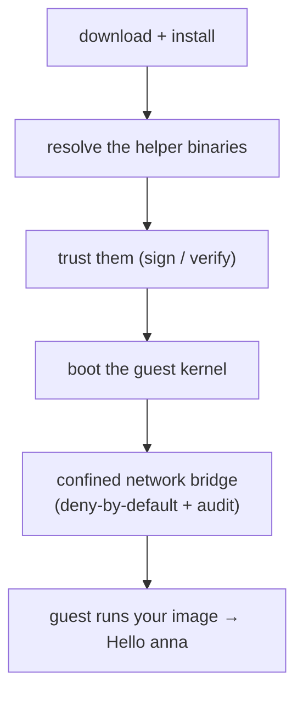
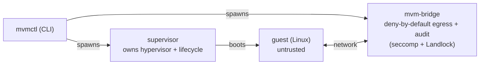

# Blog draft — "Hello anna": what it takes to prove a downloaded CLI boots a microVM in one command

**Status:** Continuous draft of the opening arc (hook → grounding → process topology → the boot bug). Revised 2026-07-10: sharper problem statement + explicit "why we're writing this" up front; §3 (the boot bug) rebuilt as a narrative with a proper landing + bridge into §4. Sections 4–11 still outlined below. Not published.
**Source:** Synthesized from the macOS-26 bring-up + release-packaging work (PRs #1300, #1302, #1303, #1307, #1309, #1367, #1369).
**Fact-check before publish:** the draft narrates vz (Virtualization.framework) as the macOS 26+ backend, which was true during the June bring-up; vz has since been removed (Plan 226 — HVF is now the macOS 26+ backend, libkrun the fallback). Decide whether to tell the vz story explicitly in the past tense ("our then-newest backend") or re-verify the PCI/MMIO table against HVF and update.

*(alt subtitles: "The iceberg under `mvmctl run`" / "Every layer between a one-liner and a running guest")*

---

## Draft (continuous — in progress)

The command is six words long:

```
mvmctl run --image alpine -- echo "Hello anna"
```

Type it, wait a beat, and `Hello anna` prints. In that beat a real Linux virtual machine booted from a container image, ran your command behind a hardware isolation boundary, and vanished. No Dockerfile, no VM console to babysit, nothing to clean up. The promise is that those six words are all you ever hold in your head.

This post is about the question hiding inside that promise: **true for whom?**

Two very different people can type that command. One is us — a developer with the source tree checked out, a warm build cache, helper binaries sitting in `target/` exactly where the tooling looks for them, and a machine that has quietly accumulated every dependency the project ever needed. The other is the person we actually built this for: a stranger on a clean laptop who read the README, downloaded a tarball, and typed six words. For months the command worked flawlessly for the first person — and we had no way of knowing whether it worked for the second at all.

That gap sounds like a packaging chore. It isn't. Your dev machine is a set of training wheels you can't feel, and taking them off breaks assumptions at nearly every layer of the stack:



We're writing this post because we just spent weeks closing that gap, and almost none of the work was where we expected it to be. The bugs weren't in a packaging script. They were in a kernel config, a binary-resolution ladder, a code-signing step, a cache reaper, and a hash that two versions of the same tool computed differently. If you ship a CLI that does anything more ambitious than transform stdin — and especially one that spawns helper processes — you will meet some version of every one of these. This is the map we wish we'd had.

One more piece of context before the descent, because it explains why the stack is this deep in the first place. **mvm is security-first.** You reach for a microVM to run code you don't fully trust behind a *hardware* isolation boundary, not a shared kernel you're hoping holds. From that one posture a cascade follows: the smallest kernel that still boots (every driver is attack surface), a confined network sidecar that default-denies egress and audits what it allows, a download you can actually verify (signed, reproducible). The download problem is hard largely *because* the bar is high — a lower bar ships one fat binary and calls it done. (A second problem rides along, saved for the back half of the post: how do you *prove* all of this works without cutting a real, irreversible release?)

We'll walk the layers roughly top to bottom. First, some grounding for anyone new to mvm.

### First, some grounding: what is mvm?

mvm boots a container image inside a real, isolated Linux microVM — `mvmctl run --image alpine -- echo hi` — aiming to feel about as light as a container with the isolation of a VM. The difference is the whole point: a container shares *your* kernel (namespaces + cgroups); a microVM brings *its own* kernel behind a hypervisor, stripped to a minimal kernel and a few virtual devices so it still boots in a fraction of a second. Firecracker — AWS Lambda's engine — is the reference, and what mvm uses on Linux.

The catch that drives this post: Firecracker needs KVM, which doesn't exist on macOS. So the *same command* runs on a *different hypervisor* depending on the host — and, as we're about to see, those hypervisors don't present the guest's hardware the same way:

| Host | Hypervisor ("backend") |
|---|---|
| Linux | **Firecracker** (via `/dev/kvm`) |
| macOS ≤ 25 | **libkrun** (in-process) |
| macOS 26+ | **vz** — Apple's Virtualization.framework |

A few terms for later: *host* = your laptop; *guest* = the VM it boots. The guest reaches its disk/net/console over *virtio*; the host reaches a small in-guest *agent* over *vsock* (a direct host↔guest socket, no network). And mvm builds images by running Nix *inside a Linux VM* — so two VMs recur: the *builder VM* (makes images) and the *workload VM* (runs yours). Both boot the same kernel.

### The command is a quiet lie

"Run" isn't one program — and that's the first place the one-command story stops being literally true. For every guest it boots, mvm stands up a small host-side constellation:



The split is a security decision, not tidiness. `mvm-bridge` sits on the single path where untrusted guest traffic reaches the host, so it does the jobs you most want isolated and watched — enforce default-deny egress, write a tamper-evident audit log — and it runs confined, where a bug in it can't reach the process holding the hypervisor handle. There's more than one process *because confinement wants boundaries between them.*

From a source checkout you never notice: every binary sits in `target/` where the tooling finds it for free. Ship it, and the entrypoint and its helpers part ways — most of what follows is about keeping them together.

### The guest has to actually boot

Everything above — supervisor, bridge, agent — presumes a guest that actually came up. Before packaging or signing or trust can even matter, that blunt fact has to hold. Here's the story of the week it didn't.

mvm ships **one guest kernel**, shared by every backend, and it is deliberately tiny. That's the security posture again: a hostile workload runs on this kernel, so every compiled-in driver is attack surface, and anything not needed gets cut. During one of those slimming passes, PCI support looked like an easy win. The note in the diff even explained why: *"libkrun and Firecracker attach virtio devices over MMIO."* Which is true. The missing clause was *"…and vz attaches them over PCI."*

Here's the one piece of plumbing you need to follow the story: virtio is the *protocol* a guest uses to talk to its virtual disk, network, console, and vsock — but those devices have to sit on a *bus* for the kernel to discover them, and different hypervisors put them on different buses:

| Backend | virtio bus | Guest kernel needs |
|---|---|---|
| libkrun, Firecracker | **MMIO** | `CONFIG_VIRTIO_MMIO` |
| vz (Apple) | **PCI** | `CONFIG_PCI` + `CONFIG_VIRTIO_PCI` |

So the slimmed kernel booted perfectly on two of our three backends. On vz, it booted into a void. The hypervisor reported the VM as running — and by its lights it was. But the console log was zero bytes, because the console is itself a virtio device the kernel could no longer see. No disk. No vsock. No agent. A machine that is alive and completely unreachable is a genuinely eerie thing to debug: nothing crashed, nothing errored, nothing logged, because the thing that would have logged was on the bus the kernel couldn't probe.

It got worse before it got better. Remember that both of mvm's recurring VMs — the builder VM that makes images and the workload VM that runs yours — boot this same shared kernel. So one missing config symbol surfaced as *two* apparently unrelated bugs, in different subsystems, with different symptoms: a builder-VM "hang" and a workload-VM "agent timeout." Nothing had failed to compile. The kernel even passed its size budget — it was *smaller*, which had been the whole point.

The fix was three lines: `PCI`, `PCI_MSI`, and `VIRTIO_PCI` restored. The proof was the console going from empty to boring:

```
EXT4-fs (vdb): mounted filesystem       ← virtio-block, over PCI
mvm-guest-agent: control plane ready     ← virtio-vsock, over PCI
```

Two lessons came out of that week, one general and one specific. The general one: a shared artifact serving consumers with different *invisible* contracts is a landmine, because a comment like "MMIO-only, dead weight" is a claim about *all* consumers that only has to be wrong about one of them. The specific one hardened into a rule we now hold ourselves to: a change to the shared kernel isn't done when it compiles and fits the size budget — it's done when it has **booted, once, on every backend that consumes it.**

And booting is only the entry fee. A guest that comes up still needs the host-side constellation from the previous section — the supervisor, the bridge — to exist on the user's machine at all. For someone running from a source checkout, they always do. For someone who downloaded a tarball, they didn't: the release shipped `mvmctl` alone, and the helpers it spawns were never packaged. That's the next layer down.

> **Still to draft (in this same continuous voice):** §4 packaging & binary resolution · §5 trust/signing/supply-chain · §6 warm-pool state & lifecycle · §7 reproducible builds · §8 the platform matrix · §9 proving it without shipping · §10 the two habits · §11 close. Outline below.

---

## Outline (the full map)

### 1. The hook: one command, one honest question *(drafted above)*
- The literal goal: `mvmctl run --image alpine -- echo "Hello anna"` should Just Work for someone who **downloaded a binary** — no repo, no build, no docs.
- Thesis: a single command is a *user-facing* simplicity paid for by *cross-cutting* complexity — and requiring it for a **downloaded** artifact (not your dev checkout) brings a dozen hidden assumptions due at once.
- Two distinct problems: (a) the layers that must line up for the guest to boot, and (b) the meta-problem of **proving** they line up without cutting a real release.

### 1.5 Background: what mvm is *(drafted above)*
- What mvm is; microVM vs container; host vs guest; builder VM vs workload VM; the per-platform backends (Firecracker/libkrun/vz); the virtio/vsock/guest-agent vocabulary.

### 2. The command is a quiet lie (process topology) *(drafted above)*
- One command → multiple host processes per guest (supervisor + `mvm-bridge` sidecar); why they're split; from a checkout `target/` hides it; shipping parts them.

### 3. The guest actually has to boot *(drafted above)*
- virtio-over-PCI (vz) vs -MMIO (libkrun/Firecracker); the slim-kernel cut that booted vz blind; one bug that looked like two; boot-on-every-backend as the real gate.

### 4. Getting the bits onto the machine (packaging & binary resolution)
- Release shipped only `mvmctl`; helpers never packaged → stranded on a download.
- Resolver ladder: `MVM_BRIDGE_PATH` → adjacent-to-exe → source `target/`. "Adjacent" is the whole ballgame for a download.
- Two edits, one idea: bundle helpers in the tarball **and** install them next to `mvmctl`.
- **Security angle:** "adjacent-to-exe" isn't only convenience — resolving the helper *you shipped* (over, say, whatever `mvm-bridge` happens to be on `$PATH`) keeps the trust boundary tight; the confined sidecar the CLI spawns should be the exact signed binary that came in the tarball.
- **Takeaway:** the unit of distribution is the *process tree*, not the entrypoint; "works from my checkout" hides this because `target/` does the resolver's job for free.

### 5. The machine has to trust the bits (signing, entitlements, supply chain)
- macOS: VMM supervisors need VZ/Hypervisor entitlements; they **self-sign** at first spawn.
- The trust chain: cosign keyless signing, SHA-256 checksums, hash-pinned seeds — a chain, not a step.
- Surprise cameo: Homebrew's untrusted-tap policy (`brew trust`) — a dependency's own supply-chain gate breaking our build.
- **Takeaway:** "downloaded" implies a trust boundary at every hop; each is a place the one-liner can silently fail.

### 6. State hides behind a "stateless" command (warm pool & lifecycle)
- Red herring: an "orphan supervisor" that was the intentional warm/standby pool (always-warm residency, TTL).
- Real bug: the standby reaper only ran on `cache prune`, never the launch path → no-daemon TTL never enforced on use. Reap-on-use fix.
- No-daemon lifecycle: expiry is lazy or self-expiring; TTL relations between independent constants become tested invariants.
- **Takeaway:** a stateless-looking command still leaves state; telling "intended cache" from "leak" is half the work.

### 7. It has to build the *same* thing everywhere (reproducibility)
- The unseen bootstrap: pinned Nix seed → builder VM image → materialize OCI rootfs, so a download builds locally with no host Nix.
- Determinism trap: a narHash divergence between Nix versions — same source, different computed hash — broke fresh-machine builds while warm caches masked it.
- **Security angle:** reproducibility is the thing that makes "trusted download" *checkable* — if the same inputs don't yield the same bytes, "verify before you run" is meaningless and hash-pinning/signing lose their teeth. Determinism is a supply-chain integrity property, not just hygiene.
- **Takeaway:** "reproducible" has a version axis; a pinned input isn't enough if the tool computing identity drifts. Warm caches hide fresh-install breakage.

### 8. The platform matrix multiplies all of the above
- Three worlds: macOS 13–25 (libkrun), macOS 26 (vz), Linux (Firecracker) + builder-backend selection + auto-fallbacks.
- Per-OS feature gating as design: `libkrun-sys` is macOS-only → "Linux doesn't ship the libkrun supervisor, by design" (a follow-up that turned out to be a non-issue after investigation).
- **Takeaway:** every piece above is really *piece × platform*.

### 9. The meta-problem: proving it without shipping it
- Your dev machine cheats (source tree, warm caches, pre-signed bins), so building it ≠ knowing it works for a download.
- The wall: only a `v*` tag runs the release pipeline, and that tag is an irreversible publish (public release + crates.io). No dry-run existed.
- The fix: a no-publish dry-run (`workflow_dispatch` + gated `dry_run`) that builds + packages on real runners and publishes nothing; download artifacts and inspect the tarball as proof.
- The twist: the dry-run immediately surfaced two pre-existing, unrelated release-blockers (brew tap; a stale smoke test hitting a renamed subcommand).
- **Takeaway:** "prove it works" needs a safe way to run the real thing; a dry-run is a first-class feature and doubles as a fast fix loop.

### 10. Two habits that did the heavy lifting
- Transient vs. real: a scary "storage device attachment invalid" that was corrupted state from killed debug runs — reproduce from clean state before believing an error.
- Investigate before implementing: the "Linux libkrun packaging" follow-up that traced out to *unnecessary* — got a comment, not code.
- (Optional) the plumbing tax: merge queues, stacked PRs, rebasing after a squash.

### 11. Closing: the shape of "just works"
- A one-liner is an SLA against a whole stack + a way to prove it without shipping.
- One-sentence recap per layer.
- End on the "Hello anna" payoff — same six words, now provable on a machine that never saw the source.

### Appendices (optional)
- "Layer cake" diagram: download → install (adjacent bins) → resolve → sign → boot (PCI!) → bridge → guest.
- PR trail (the receipts).
- Checklist: "Is your one-command CLI actually downloadable?" (ships all processes? resolves adjacent? signs at runtime? builds deterministically? has a no-publish dry-run?).
- Glossary (below).

---

## Glossary

- **microVM** — a stripped-down virtual machine (minimal kernel, a few paravirtual devices, no legacy hardware) that boots in a fraction of a second; VM-grade isolation at near-container speed.
- **host / guest** — the host is your Mac/Linux machine running `mvmctl`; the guest is the Linux VM it boots.
- **hypervisor / backend** — the thing that actually runs the VM. mvm's backends: **Firecracker** (Linux/KVM), **libkrun** (older macOS, in-process), **vz** (Apple's Virtualization.framework, macOS 26+).
- **KVM** — the Linux kernel's hardware-virtualization interface (`/dev/kvm`). Firecracker needs it; it doesn't exist on macOS.
- **virtio** — the standard paravirtual device protocol a guest uses for disk, network, console, vsock, etc.
- **PCI vs MMIO** — the two *buses* virtio devices can be attached to. libkrun/Firecracker use MMIO; vz uses PCI. The guest kernel needs the matching support compiled in to see its devices (the boot section).
- **vsock** — a direct host↔guest socket channel (no network) used to reach the guest agent.
- **guest agent** — a small process inside the VM that the host talks to over vsock (readiness, exec, etc.).
- **builder VM vs workload VM** — mvm runs Nix *inside a Linux VM* to build guest images (the builder VM); the workload VM is the one that runs your image. Both boot the same shared kernel.
- **supervisor / sidecar** — host-side helper processes mvm spawns per guest: a per-VM VMM *supervisor* (`mvm-vz-supervisor` / `mvm-libkrun-supervisor`) and the `mvm-bridge` gateway/audit *sidecar*.
- **mvmctl** — the CLI binary; "mvm" is the project.
